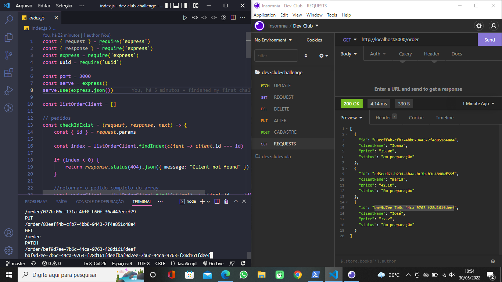

# challenge-node
Node module challenge DevClub

 

> Challenge performed in the Node module of DevClub. In it is made requests for snacks, as well as deleted, changed and updated from "in preparation" to "ready". In this challenge, you could fix what was taught in the classes of the Node module (express, nodemon, uuid, json, parameters - query, route, body - and gitignore).

## 🤝👩🏻 Collaborator

<table>
  <tr>
    <td align="center">
      <a href="#">
         
        
          <b>Isnaíra Souza</b>
        
      </a>
    </td>
    
</table>

[⬆ Voltar ao topo](#Convert-Money) 